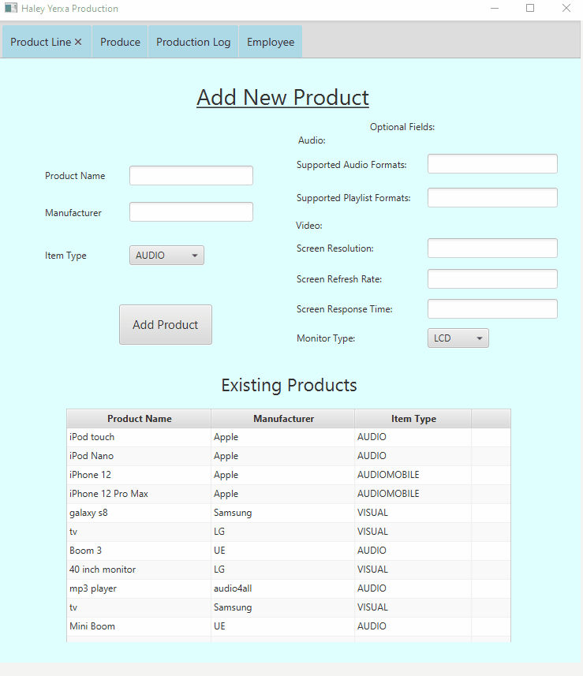

# Production
This project is an application for a media player production facility that allows employees to sign in, add products, and create production records. 
This was made by author Haley Yerxa as a class project, with some assistance from Professor Scott Vanselow, student assistants, and classmates.
Created Fall 2020, a semester long project as a 3rd year software engineering student in an Object- Oriented Programming class at Florida Gulf Coast University.
Was made in class as an assignment, but was taken as a challenge to further skills and become more proficient in Java, Databases, and associated OOP skills.
## Demonstration

## Documentation
[JavaDoc](https://hyerxa.github.io/Production/package-summary.html)
## Diagrams

## Getting Started
This project is built using Gradle on Intellij Idea, so for optimal performance, I recommend cloning work into Intellij Idea. 
Requires Java, currently configured for SDK 11. Gradle build file is included, so minimum configuration is required. 
Uses JavaFX, for development purposes I recommend downloading and using SceneBuilder.
To run the executable, go to bin/lib and run the jar file from Intellij, or the batch file which executes the proper command.
## Built With
* Intellij Idea Ultimate
* JavaFx and SceneBuilder
* Gradle
* H2 Database
## Contributing
If you would like to contribute, feel free to branch and clone the code, contributions are always welcome!
## Author
Haley Yerxa
## License
[License](LICENSE)
## Acknowledgments
* Professor Scott Vanselow
* TAs Andrew Cavallaro, Vladimir Hardy, Robert Kissinger, Sean Lamont, Jeremy Martin
* A few code tutorials were consulted, including:
    * [H2 Database - JDBC Connection](https://www.tutorialspoint.com/h2_database/h2_database_jdbc_connection)
    * [JavaFX Multiple Controllers Tutorial](https://github.com/mvpjava/javaFX-multiple-controllers-tutorial/blob/master/src/main/java/com/mvp/java/controllers/MainController.java)
    * [Using Recursion To Reverse A String in Java](https://beginnersbook.com/2017/09/java-program-to-reverse-a-string-using-recursion/)
    * [Java Read Files](https://www.w3schools.com/java/java_files_read.asp)
## History
Developed in three sprints:
1. Set up GUI and basic database connection.
2. Add object-oriented concepts and implementation.
3. Complete Database integration and add finishing touches.
## Key Programming Concepts Utilized
* Used the three pillars of object-oriented programming:
  1. Inheritance: Program incorporates several levels of inheritance and implementation. For example, abstract class Product is extended into AudioPlayer and MoviePlayer classes
  2. Polymorphism: Program implements several interfaces and methods in different ways in separate classes. For example, both AudioPlayer and MoviePlayer implement Multimedia Control differently.
  3. Encapsulation: Modifying Accessors for fields of different classes allows for usage between classes. For example, the serial number of a product is set by accessing the most recent product and incrementing.
* Recursive Methods were learned in this course, implemented as encryption for the password.
* Basic Database querying and connection skills were used.
* Enums, interfaces, and abstract classes were created and implemented.
* Error handling and control structures such as switch case statements were implemented where necessary.
* Controller dependency injection was implemented between controllers to ease the flow of data between tabs.

